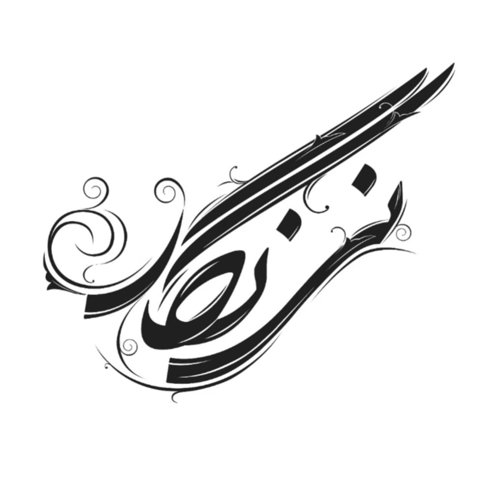

# 🎨 NeyNegar 2.0 — Persian Visual Arts Platform



**NeyNegar** is a modern online platform focused on **calligraphy, painting, design**, and visual arts.  
This version is completely rebuilt using **Next.js**, **GraphQL**, and **modern UI/UX** technologies to deliver a clean, fast, and reliable experience.

🌐 Live: [https://neynegar1.ir](https://neynegar1.ir)

---

## 🌟 Key Features

- 🛍️ **Art Products:**  
  A wide variety of books, calligraphy tools, paintings, and art supplies.

- 🧠 **Educational Articles:**  
  Insightful content about visual arts, techniques, and history.

- 🛡️ **Verified & Trusted:**  
  Holds the official Electronic Trust Symbol (نماد اعتماد الکترونیکی).

- 🔐 **SMS Authentication:**  
  Secure login/signup via **Faraaz SMS** API.

- 📱 **Responsive & Accessible:**  
  Fully responsive layout for desktop, tablet, and mobile.

---

## 🧰 Tech Stack

### 🎯 Front-end

- [Next.js](https://nextjs.org/)
- [React](https://reactjs.org/)
- [TypeScript](https://www.typescriptlang.org/)
- [Tailwind CSS](https://tailwindcss.com/)
- [Apollo Client](https://www.apollographql.com/docs/react/)
- [SWR](https://swr.vercel.app/)
- [Swiper](https://swiperjs.com/)
- [Material UI (MUI)](https://mui.com/) — for icons and components
- **SMS Auth via FarazSMS**
  
### 🔗 Back-end (External GraphQL API)

> This repository includes only the front-end.  
> The backend is built with **Node.js**, **GraphQL**, **JWT**, and **MongoDB**.

---

## 🧾 Project Structure

```
public/
  ├─ Font/
  ├─ Img/
src/
  ├─ app/
  │   ├─ account/
  │   ├─ article/
  │   ├─ basket/
  │   ├─ category/
  │   ├─ cms/
  │   ├─ course/
  │   ├─ login/
  │   └─ product/
  ├─ lib/
  │   ├─ actions/
  │   ├─ Components/
  │   ├─ CustomeHook/
  │   ├─ graphql/
  │   ├─ Types/
  │   ├─ utils/
  │   └─ validation/
  └─ types/
```


---

## 🛣️ Roadmap

- ✅ Migration to Next.js App Router  
- ✅ GraphQL integration  
- ✅ SMS OTP login  
- ✅ Admin dashboard improvements  
- ⏳ AI article generator with review flow  

---

## 🤖 AI Article Generator (Coming Soon)

A content tool to generate, moderate, and publish calligraphy-related articles with the help of AI and human validation.

---

## 📬 Contact

For feedback, suggestions or questions, feel free to contact me at:

- 📧 Email: [jvd.malek0079@gmail.com](mailto:jvd.malek0079@gmail.com)
- 🔗 [LinkedIn](https://www.linkedin.com/in/javad-malekian)  
- 💻 [Back-end Repository](https://github.com/jvd-malek/neynegar-graphql-version)
  
Visit [neynegar1.ir](https://neynegar1.ir) for more information or to get in touch.

---

## ⭐ Contributions

If you’d like to contribute, feel free to fork the repo and submit a pull request.  
All kinds of suggestions are welcome!

---

## 📄 License

MIT © 2025 | Developed by [Javad Malek](mailto:jvd.malek0079@gmail.com)
